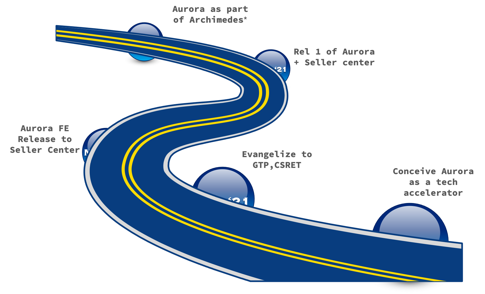

# Aurora Framework

The Aurora framework provides a comprehensive way to build Micro Apps. Micro Apps extend the capabilities of a Micro Front end framework and facilitate a unified way of building both the front end widgets and back end micro services in a federated manner.

The Micro Apps can be discovered during runtime. Aurora leverages a stable tech stack coupled with best practices from the industry. Since Micro Apps can be maintained and deployed independently it is possible to create complex experiences in a truly distributed manner.

Aurora components are deep - i.e. they span both frontend and backend. These components can be discovered and combined in multiple ways to create a comprehensive user experience to the end user. Aurora hides the complexity and seamlessly unifies. 

# Aurora Evolution

Aurora evolved as a framework from the desire to rewrite the Seller Center application in Market Place. It was conceived as tech accelerator framework that expedites the creation of new apps. 

Aurora was later evangelized to CSRET (Core Services, Retail & Emerging Tech) and then to the Global Technology Platform (GTP) groups. 

The first version of Seller Center rearchitecture was then rolled out with the focus on creating federated Front end apps. 

When the second version of Seller Center was released, Aurora was detached from it and made available as an independent framework. 

Since then, Aurora has become an integral part of [Project Archimedes](https://confluence.walmart.com/pages/viewpage.action?spaceKey=CSRETTC&title=Walmart+Leverage+Initiative+%3A+Project+Archimedes)

# Alignment with Archimedes
Archimedes provides a perfect reuse platform that spans across multiple initiatives, frameworks and organizations within Walmart. Aurora is an integral part of the Archimedes vision. It realizes the reuse potential that is envisaged as a key Archimedes objective. 

Aurora creates artifacts that can be reused across organizations. Aurora can also consume other artifacts published under the auspices of the Archimedes program. 

# Aurora presentation links 

* [Aurora Frontend Architecture](https://my.wal-mart.com/:p:/r/personal/r0k02sw_homeoffice_wal-mart_com/Documents/Aurora-Framework-Frontend.pptx?d=w7a349339719b42208b29a8a55e3dc077&csf=1&web=1&e=unDBEd)
* [Aurora Backend Architecture](https://my.wal-mart.com/:p:/r/personal/r0k02sw_homeoffice_wal-mart_com/Documents/Aurora-Framework-Backend.pptx?d=wfb84da50c2bb455a945cecc6a2fd6477&csf=1&web=1&e=Bjnd22)
* Aurora Core (Chenile) repo link - https://gecgithub01.walmart.com/RET-Marketplace/aurora-core
* Aurora Common repo - https://gecgithub01.walmart.com/RET-Marketplace/aurora-common

