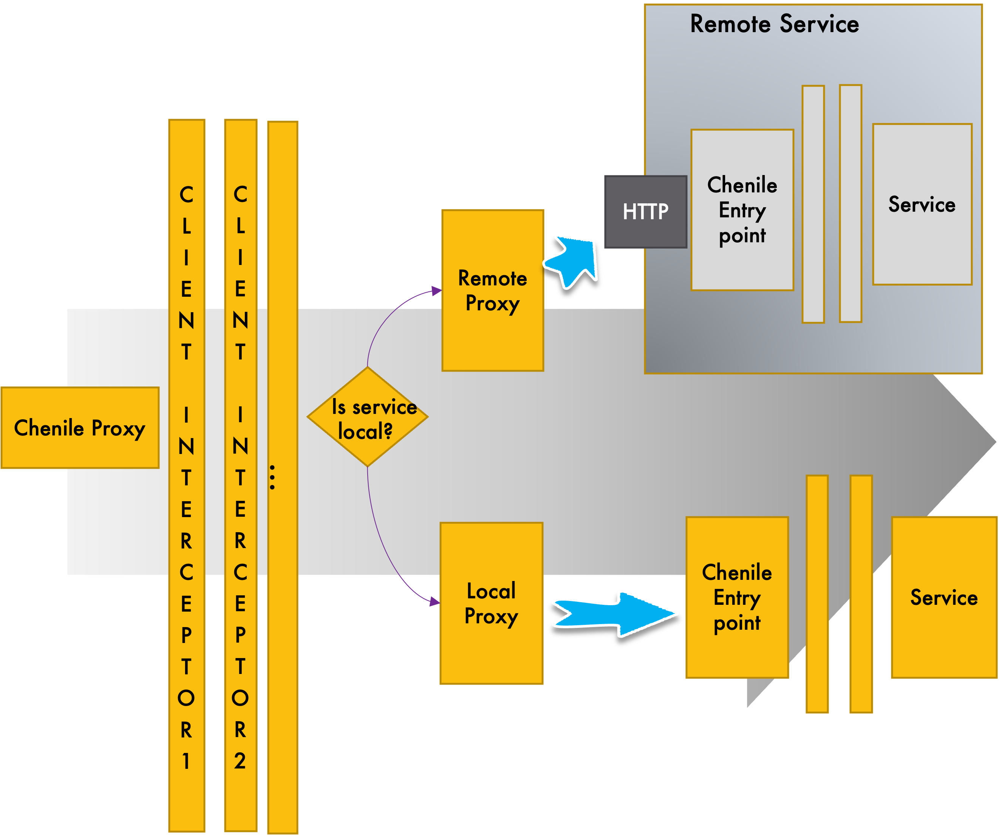

# Proxy Framework

* Proxy provides an injectable implementation of a service (i.e. it has the same interface as the actual service) 
* Proxy supports client-side interception capabilities. Concerns such as near caching can be addressed using client-side interceptors.
* Client-side interceptors are interchangeable with server-side interceptors. This allows flexibility for architects to choose where the interceptors are injected
* Proxy routes to a local or remote proxy depending on where the actual service exists
* Local proxy delegates to the local Aurora entry point.
* Remote proxy manages interactions with the remote server via HTTP
* These capabilities make the Aurora framework a service mesh with both ingress and egress interception capabilities

