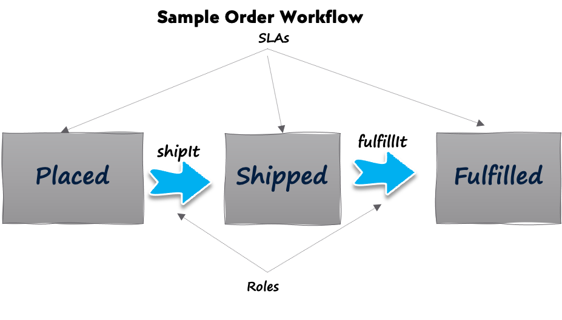

# The Mutation Problem
Important resources need to be mutated over a period of time using non-idempotent operations. In general, the mutations are not arbitrary - there need to be well-defined precise actions that need to be performed on the entity. These actions are further influenced by the state of the entity. As the state of the entity changes, the actions can also change. Application code typically validates these actions and checks if they are applicable.

The state model provides a natural way of modeling the states and the actions. A State transition diagram (STD) is a directed graph with the states represented as nodes and the actions representing the edges. For example, look at the following graph of an order. 

The different states such as _Placed_, _Shipped_ and _Fulfilled_ are states that determine the actions such as _shiptIt_ and _fulfillIt_. The actions are also called events that are sent to the mutable entity. In short, an STD represents the states and events.

With this background, we present some Chenile recommendations about graphs:

* Events must be used to mutate entities
* Events must depend on the state of the entity
* When a mutable entity is returned as part of a documented API, the actions that are allowed on the entity must also be returned. In short, API must support HATEOAS to return the set of valid actions for an entity given its state
* If a user signs to an application and queries for all orders (for example) then the user must be presented with the orders that he/she can act on. This allows for the creation of a task driven UI.

# Features of The Chenile State Transition Machine
* Configurable Workflow
	- DSL Support
	- Support for XML, Fluent API  & other configurations
	- Workflow can change based on region, A-B test etc.
* Meta data at the state and event level
	- Meta information such as roles and SLAs can be stored. Actions can use this information to drive business logic
* Support for Automatic State events. The state machine can generate events automatically for certain states based on business logic. E.g., Automatically approve all orders with order total < $200 
* Script auto states (such as if)  are available out of the box
* HATEOAS Support
	- State machine can emit all applicable events for a state
* Light weight
	- Embedded within JVM
	- All state transition workflows are cached during start up
* BluePrints 
	Ready made blueprints for setting up a HTTP service with embedded state flow

# Details 
The Chenioe STM provides a way to configure the states and the allowed events for each state. This configuration is accomplished using various ways including __XML__ and __fluent API__. Every interaction is modeled using an event. All events are processed during runtime by the Chenile state transition machine. If an event is invalid for the state, an exception is thrown. Otherwise, the action that corresponds to the event is invoked. The entity might advance to the next state (if required. Remember that all events dont result in a change of state for the entity). 

The Chenile XML configuration supports Domain Specific Language. (DSL) This can considerably contribute towards adding clarity to the State Transition configuration. 

It is possible to construct multiple instances of STM with different configurations in accordance with region, language, A-B cohorts etc. This makes it super flexible to accommodate multiple variations of the same workflow. 

The entire STM runs within the JVM. Since all configurations are typically read during start up, the STM performance is blazing fast. The STM ecosystem also provides an ActionInfoProvider that allows for the computation of applicable actions given the state of the entity. This makes it possible to support HATEOAS (Hypermedia As The Agent Of Application State). UI needs to merely paint the buttons that are applicable. 

The STM configuration allows the developer to attach meta data at the state or the event level. This meta data can be used to do sophisticated actions. Example, it is possible to store the ACLs at an event level. This allows specific users to be provided access to these actions. 

Similarly, it is possible to store SLAs for specific states. For example, if the SLA is 2 days at the Placed state above, then the order becomes "red" after 2 days of inactivity. This facilitates task driven UIs. The red orders can surface to the top. This allows for timely actions by the concerned individuals. 

